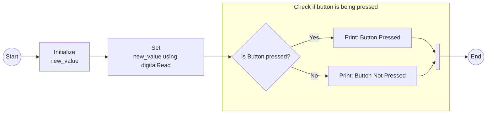
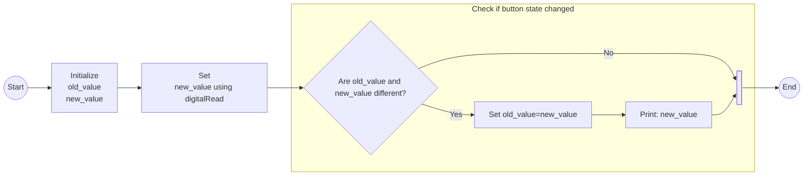
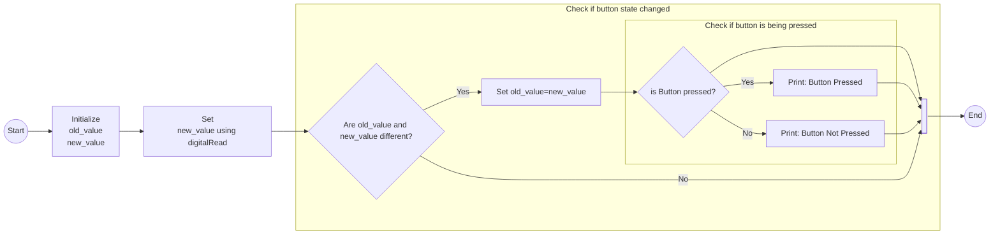

# Flowchart for button pressed
Dette er et flowchart når man trykker på en knap.
Det viser hvordan if/else conditionals kan beskrives i flowcharts, og hvordan man kan bygge funktionalitet op af flere.
## Flowchart for button pressed

## Flowchart for state changed

## Flowchart for combination
